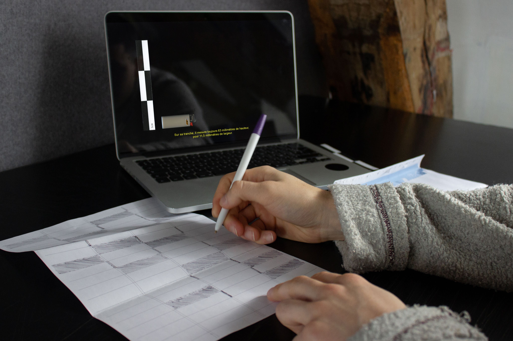
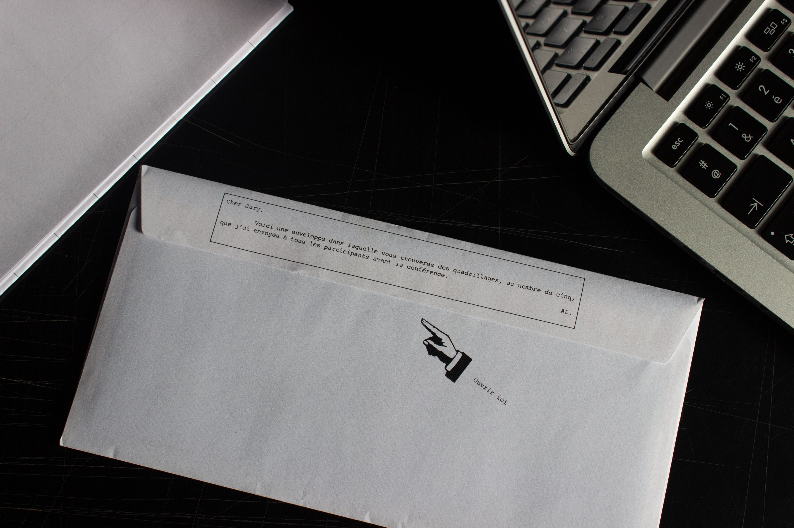
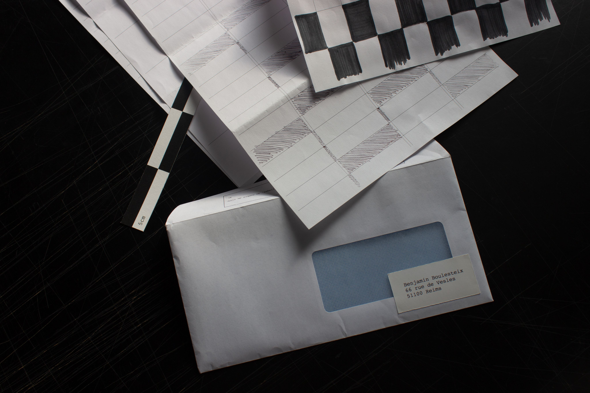
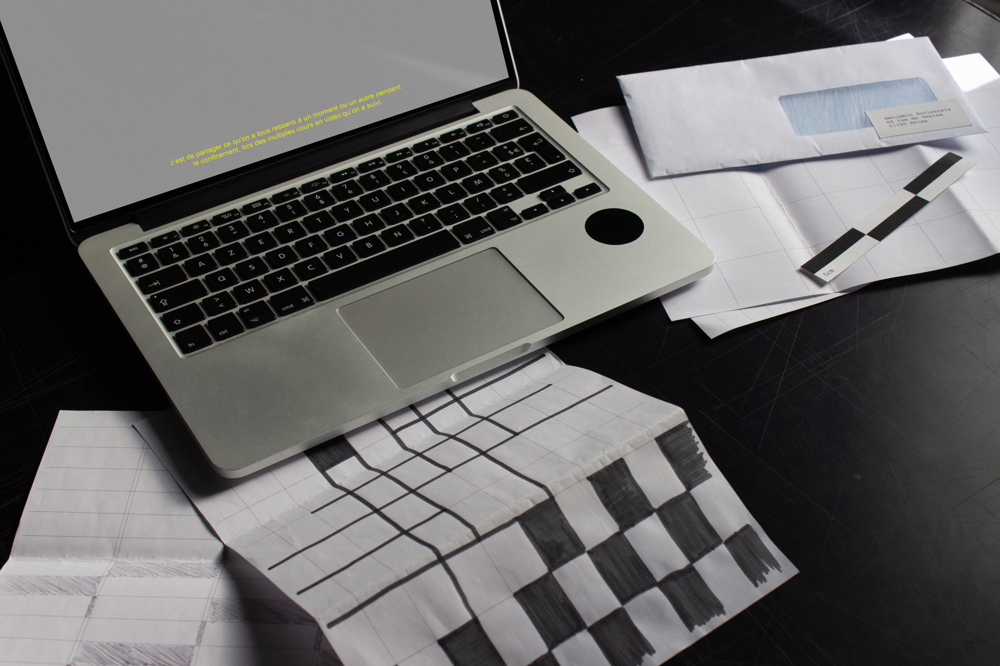

Durant cette conférence, j’ai abordé le thème de l’ennui, que l’on peut tous ressentir devant nos écrans en cette période si particulière. Pour ce faire, j’ai décrit des objets présents sur mon bureau, que je manipule dans les moments de déconcentration. Une enveloppe contenant des « quadrillages de l’ennui » à été envoyée à tous les participants, afin qu’ils puissent avoir un support pour combler leur ennui.

