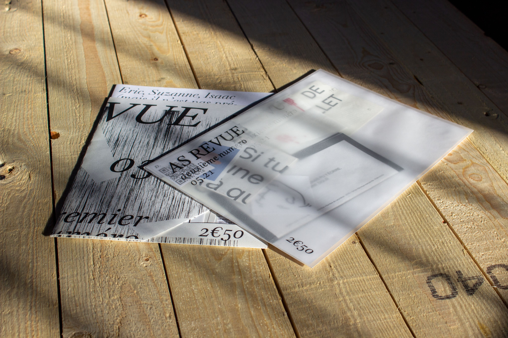
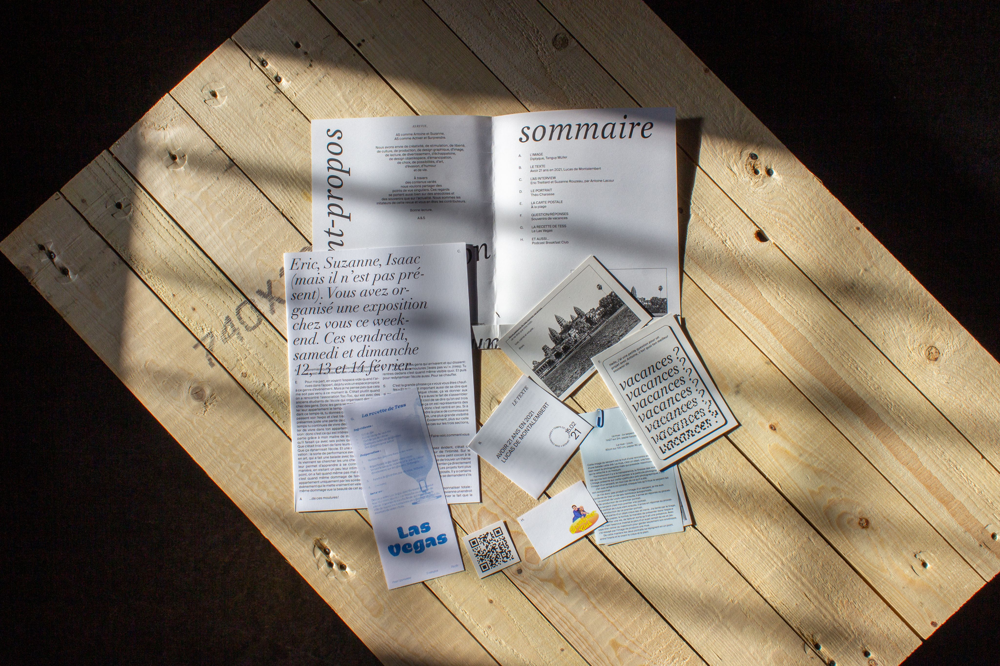
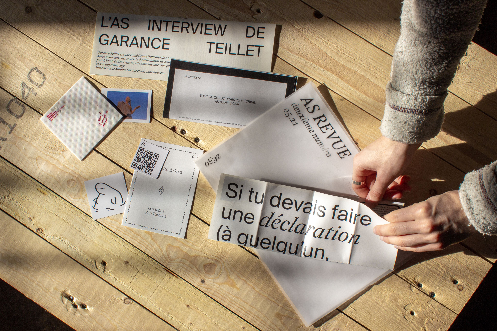

L’AS Revue est un projet pensé et réalisé avec Suzanne Rouzeau. Avec les temps qui couraient (n.b. le corona et le confinement), nous avions envie de partager et de diffuser des contenus (textes, images, interviews, vidéos, etc.) de notre entourage. La revue a été pensée  pour être le plus économique possible en terme de production.

