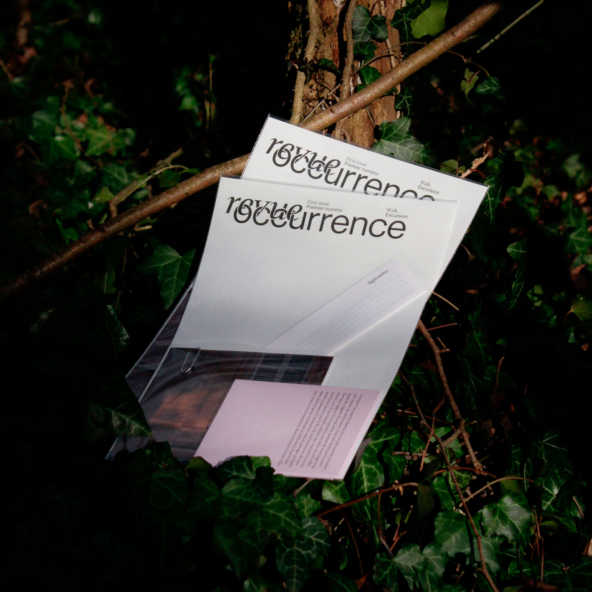
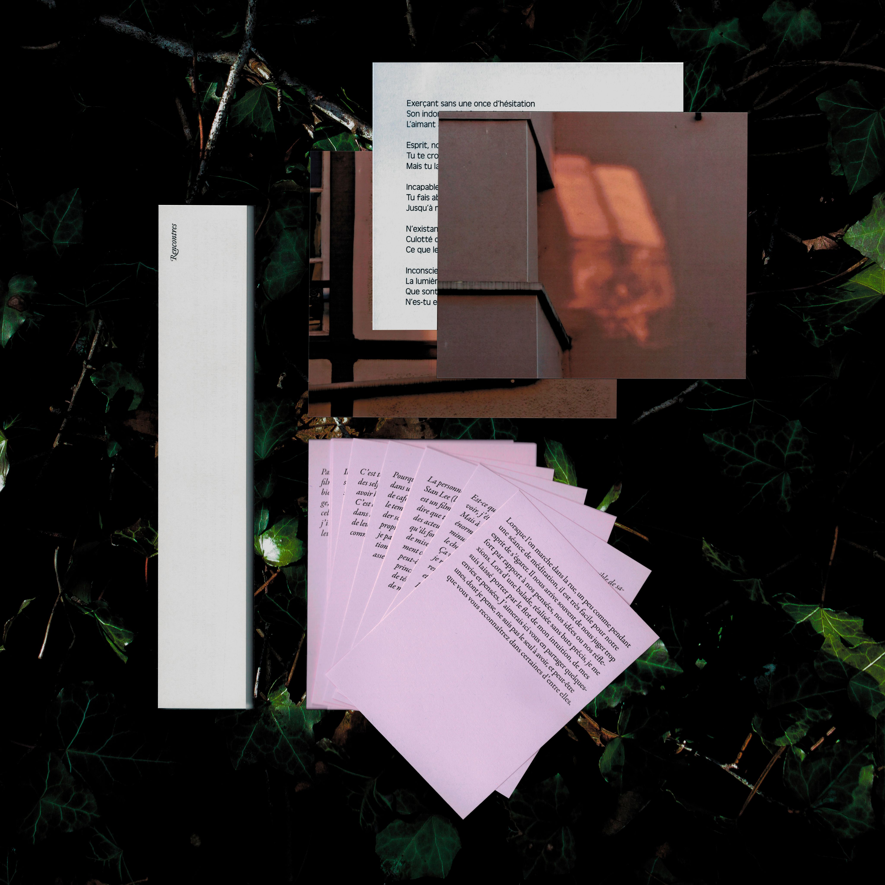

Occurrence c’est une revue dont le design à été pensé avec Camille Wisniewski, qui aborde la thématique de l’ordinaire, du quotidien, du quelconque, du commun, de l’habituel. Chaque numéro est une invitation lancée à plusieurs artistes/auteur·ice·s à écrire, produire pour un numéro sur un thème proposé. Le premier numéro aborde l’excursion, la promenade, la balade.

